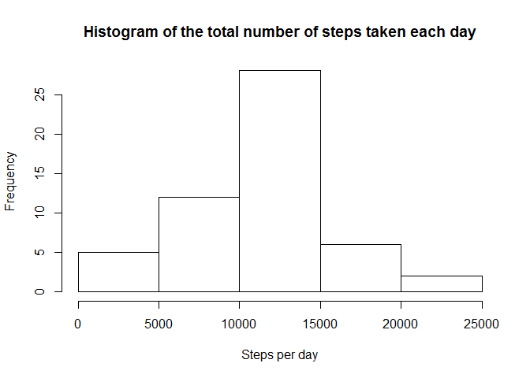
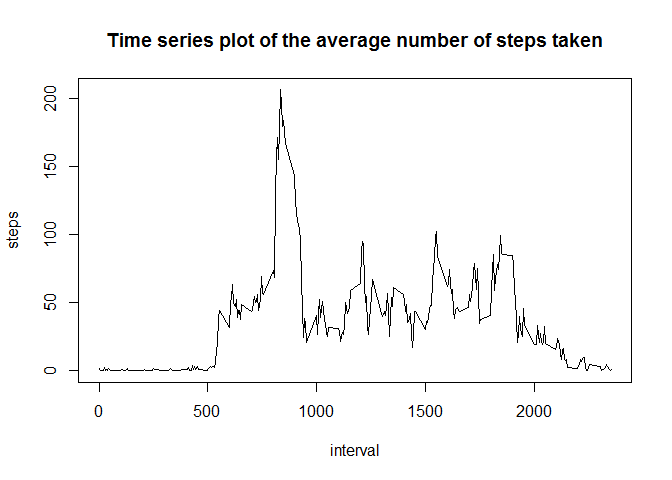
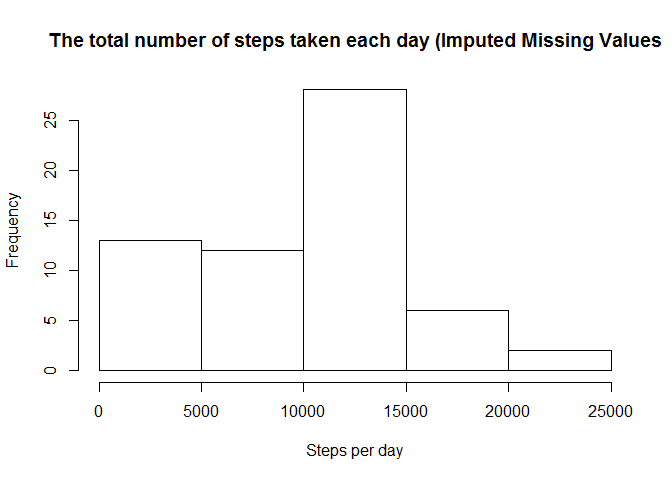
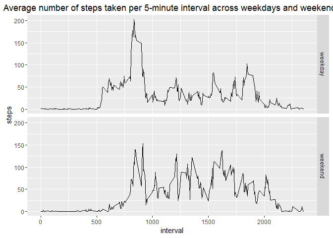

# Reproducible Research Week 2


## PreProcess
1. Read data into memory via read.csv
2. Change Date from String to Date


```r
df.activity.data <- read.csv("activity.csv")
df.activity.data$date <- as.Date(df.activity.data$date, format = "%Y-%m-%d")
```

## Tasks

### 1. Histogram of the total number of steps taken each day


```r
df.activity.steps_per_day <- aggregate(steps ~ date, data = df.activity.data, sum)
df.activity.steps_per_day
```

```
##          date steps
## 1  2012-10-02   126
## 2  2012-10-03 11352
## 3  2012-10-04 12116
## 4  2012-10-05 13294
## 5  2012-10-06 15420
## 6  2012-10-07 11015
## 7  2012-10-09 12811
## 8  2012-10-10  9900
## 9  2012-10-11 10304
## 10 2012-10-12 17382
## 11 2012-10-13 12426
## 12 2012-10-14 15098
## 13 2012-10-15 10139
## 14 2012-10-16 15084
## 15 2012-10-17 13452
## 16 2012-10-18 10056
## 17 2012-10-19 11829
## 18 2012-10-20 10395
## 19 2012-10-21  8821
## 20 2012-10-22 13460
## 21 2012-10-23  8918
## 22 2012-10-24  8355
## 23 2012-10-25  2492
## 24 2012-10-26  6778
## 25 2012-10-27 10119
## 26 2012-10-28 11458
## 27 2012-10-29  5018
## 28 2012-10-30  9819
## 29 2012-10-31 15414
## 30 2012-11-02 10600
## 31 2012-11-03 10571
## 32 2012-11-05 10439
## 33 2012-11-06  8334
## 34 2012-11-07 12883
## 35 2012-11-08  3219
## 36 2012-11-11 12608
## 37 2012-11-12 10765
## 38 2012-11-13  7336
## 39 2012-11-15    41
## 40 2012-11-16  5441
## 41 2012-11-17 14339
## 42 2012-11-18 15110
## 43 2012-11-19  8841
## 44 2012-11-20  4472
## 45 2012-11-21 12787
## 46 2012-11-22 20427
## 47 2012-11-23 21194
## 48 2012-11-24 14478
## 49 2012-11-25 11834
## 50 2012-11-26 11162
## 51 2012-11-27 13646
## 52 2012-11-28 10183
## 53 2012-11-29  7047
```

```r
hist(df.activity.steps_per_day$steps, xlab="Steps per day", main="Histogram of the total number of steps taken each day")
```

<!-- -->

### 2. Mean and median number of steps taken each day

```r
df.activity.steps_per_day.mean <- mean(df.activity.steps_per_day$steps)
df.activity.steps_per_day.median <- median(df.activity.steps_per_day$steps)
df.activity.steps_per_day.mean 
```

```
## [1] 10766.19
```

```r
df.activity.steps_per_day.median
```

```
## [1] 10765
```


### 3. Time series plot of the average number of steps taken

```r
df.average_steps_per_interval <- aggregate(steps ~ interval, data = df.activity.data, mean)
plot(df.average_steps_per_interval, type="l", main="Time series plot of the average number of steps taken")
```

<!-- -->

### 5.The 5-minute interval that, on average, contains the maximum number of steps

```r
df.average_steps_per_interval$interval[which.max(df.average_steps_per_interval$steps)]
```

```
## [1] 835
```

### 6. Code to describe and show a strategy for imputing missing data

```r
sum(apply(df.activity.data, 1, function(row) any(is.na(row))))
```

```
## [1] 2304
```

```r
df.activity.imputed <- df.activity.data
df.activity.imputed$steps <- approxfun(seq_along(df.activity.data$steps), df.activity.data$steps, method="linear", rule=2)(seq_along(df.activity.data$steps))
if(any(is.na(df.activity.imputed))) {print("WARN: NA values in df.activity.imputed")}
```

### 7. Histogram of the total number of steps taken each day after missing values are imputed

```r
df.activity.imputed.steps_per_day <- aggregate(steps ~ date, data = df.activity.imputed, sum)
hist(df.activity.imputed.steps_per_day$steps, xlab="Steps per day", , main="The total number of steps taken each day (Imputed Missing Values")
```

<!-- -->

### 8

```r
df.activity.imputed.steps_per_day.mean <- mean(df.activity.imputed.steps_per_day$steps)
df.activity.imputed.steps_per_day.median <- median(df.activity.imputed.steps_per_day$steps)
```


```
## [1] 9354.23
```

```
## [1] 10395
```

```
## [1] 10766.19
```

```
## [1] 10765
```


### 9. Panel plot comparing the average number of steps taken per 5-minute interval across weekdays and weekends

```r
weekorweekend <- function(date) {
    if (weekdays(date) %in% c("Saturday", "Sunday")) {"weekend"} else {"weekday"}
}
df.activity.imputed$weekorweekend <- as.factor(sapply(df.activity.imputed$date, weekorweekend))
df.activity.imputed.weekorweekend <- aggregate(steps ~ interval + weekorweekend, data = df.activity.imputed, mean)
suppressMessages(library(ggplot2))
```

```
## Warning: package 'ggplot2' was built under R version 3.2.4
```

```r
ggplot(data = df.activity.imputed.weekorweekend, aes(x=interval, y=steps)) + facet_grid(weekorweekend ~ .) + geom_line() + ggtitle("Average number of steps taken per 5-minute interval across weekdays and weekends")
```

<!-- -->


